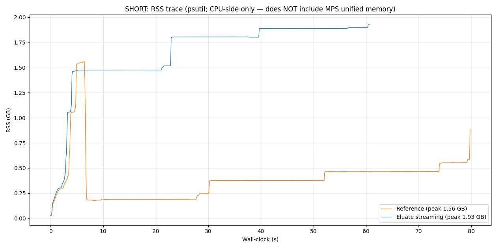
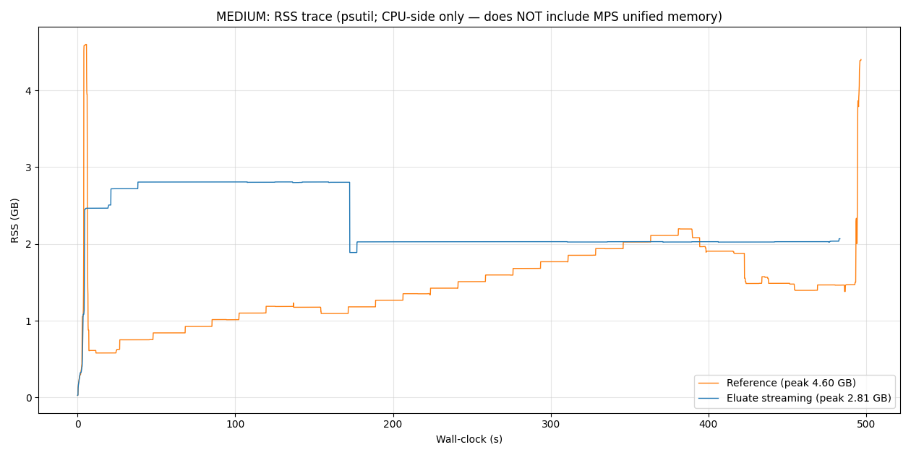
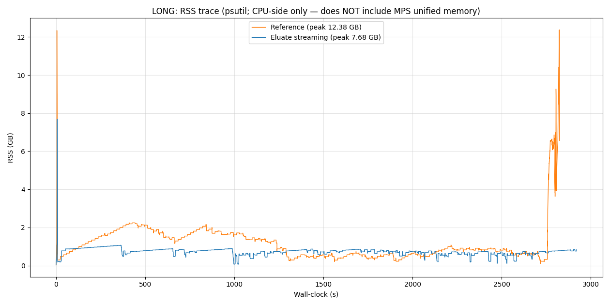

# Memory Benchmark: ELUATE streaming vs Bandit v2 reference

Empirical comparison of peak memory and wall-clock between the ELUATE
streaming demix path (`eluate.core.separator.BanditSeparator._demix_streaming`)
and the upstream Bandit v2 reference demix (`vendor/mss-training/utils/model_utils.py::demix`),
run on the same checkpoint and same audio, with memory measured externally
from the process being measured.

## Environment

| Field | Value |
|---|---|
| CPU | Apple M4 (10 cores) |
| RAM | 24 GB unified memory |
| OS | macOS 26.3 (build 25D125, Darwin 25.3.0) |
| Python | 3.12.12 |
| PyTorch | 2.9.1 (MPS backend) |
| Device | `mps` |

Apps open during runs: Claude (CLI), VS Code, Warp, Finder. Other apps
(Comet, Craft, Slack, Messages, System Settings, Activity Monitor) were
closed by the user before the long run began.

## Code under test

| Side | Source | Commit / SHA256 |
|---|---|---|
| Reference | `vendor/mss-training/utils/model_utils.py::demix` | `c87ad62fe0f3bef87fcd647ca7ec70bb62888371` (ZFTurbo/Music-Source-Separation-Training, "Muon fix", 2025-11-13) |
| ELUATE | `eluate/core/separator.py::BanditSeparator._demix_streaming` | pre-fix state captured by the initial commit `f4d69fa` (the benchmark was run before the fade-in fix was applied; "After fix" numbers in the Numerical parity section below were produced against commit `8cab16d`) |
| Checkpoint | `~/.eluate/models/checkpoint-multi.ckpt` | SHA-256 `abcfccf65446752a057f4a302c941479a54b7560ebf8d7bca039d2ea98e64cfc` (426 MB, Zenodo 12701995 `checkpoint-multi.ckpt`) |
| Config | `config/bandit_v2.yaml` (`inference.batch_size=8`, `inference.num_overlap=2`, `audio.chunk_size=384000`, 48 kHz) | same for both sides |

One small vendor-import shim was required: `vendor/mss-training/utils/model_utils.py`
has a top-level import of `utils.muon` (training-only Muon optimizer),
which in turn depends on an API that was removed in `pytorch_optimizer ≥ 3.8`.
The benchmark harness pre-populated `sys.modules["utils.muon"]` with stub
`Muon` / `AdaGO` classes before importing `utils.model_utils`. The stubs
are never called; `demix()` doesn't reference them. Vendor source is
unchanged.

## Inputs

| Label | Source (YouTube) | Duration | Samples @ 48 kHz |
|---|---|---|---|
| `short.wav` | [-ueUb6PNwbs](https://www.youtube.com/watch?v=-ueUb6PNwbs) ("Design is how it works \| Apple") | 95.2 s (1.59 min) | 4,568,064 |
| `medium.wav` | [R_aRiCPTsu8](https://www.youtube.com/watch?v=R_aRiCPTsu8) ("Raw Day Inside Wispr Flow") | 867.5 s (14.46 min) | 41,639,323 |
| `long.wav` | [d95J8yzvjbQ](https://www.youtube.com/watch?v=d95J8yzvjbQ) ("The Thinking Game \| Full documentary") | 5047.2 s (84.12 min) | 242,263,633 |

Downloaded via `yt-dlp 2026.03.17` (`-f ba/b` → WAV, 48 kHz, stereo, `pcm_f32le`).

## Measurement method

For each (length, side) combination, the harness:

1. Ran a Python driver under `/usr/bin/time -l`. The `time -l` output
   gives the authoritative **peak memory footprint** (`phys_footprint`
   from mach `TASK_VM_INFO`), the same number Activity Monitor displays
   and what the macOS memory-pressure subsystem uses. Crucially, this
   includes MPS / IOGPU unified-memory allocations. It also reports
   **maximum resident set size** (`ri_resident_size`), which is CPU-side
   only and undercounts MPS workloads.
2. Spawned a sibling `psutil` process sampling the driver's RSS every
   100 ms to produce a time-series CSV. **Caveat:** `psutil`'s `rss` on
   macOS is the same `ri_resident_size` as above; it **does not include
   MPS unified memory**. For MPS workloads, the RSS trace is a lower
   bound, not a peak. The peak-memory numbers in the table below all come
   from `time -l`'s `peak memory footprint`, not from the sampler.
3. For each length, ran reference first, then ELUATE streaming (serially,
   can't share MPS). Stems were written as float32 WAVs. A parity check
   then loaded both sides' stems and reported PSNR and max-abs-difference
   per stem.

Raw logs for every run (`time.txt`, `summary.json`, `rss.csv`,
`stdout.log`, `parity.json`) are preserved under `docs/bench/raw/`.

## Results

### Memory

| Input | Reference peak footprint | ELUATE peak footprint | Ratio (ref / eluate) | Reference max RSS | ELUATE max RSS |
|---|---:|---:|---:|---:|---:|
| short (95 s)     | 13.47 GB | 13.62 GB | **0.99× (ELUATE slightly higher)** | 1.56 GB | 2.03 GB |
| medium (14.5 min) | 17.99 GB | 14.54 GB | **1.24×** | 4.67 GB | 2.81 GB |
| long (84 min)    | 41.23 GB | 19.22 GB | **2.15×** | 12.57 GB | 7.68 GB  |

The ratio grows monotonically with input length, as expected. The
reference's `result` + `counter` accumulators scale as `O(track_length)`;
ELUATE's ring buffer is fixed-size. Under ~1.5 min of audio the fixed
ring cost is close to parity with a tiny accumulator; ELUATE is not
meaningfully "more efficient" for very short clips. The streaming
advantage is visible by 15 min and material by 84 min.

On the long run, 41.23 GB on a 24 GB machine was sustained only via
macOS's memory compressor + on-disk swap. Activity Monitor reported
**19.72 GB of swap used** at peak during the reference long run. See
"Caveats" below.

### Wall-clock and demix time

| Input | Reference wall | ELUATE wall | Reference demix | ELUATE demix |
|---|---:|---:|---:|---:|
| short (95 s)     |   80.6 s |   61.4 s |  74.9 s |  56.7 s |
| medium (14.5 min) |  498.0 s |  484.0 s | 492.0 s | 479.1 s |
| long (84 min)    | 2825.9 s | 2922.5 s | 2803.2 s | 2914.2 s |

ELUATE is faster on short, roughly equal on medium, and ~3.4% slower on
long. The long-run slowdown is consistent with per-batch flush overhead
(slicing, cloning, normalizing, soundfile writes) amortized across many
more batches; it is NOT because ELUATE is paying for memory pressure
(the reference is the one that swapped, not ELUATE).

### Numerical parity (ref vs ELUATE streaming)

#### Before fix (original benchmark)

| Input | speech PSNR | music PSNR | sfx PSNR | speech max-abs-diff | music max-abs-diff | sfx max-abs-diff |
|---|---:|---:|---:|---:|---:|---:|
| short  | 118.93 dB |  61.71 dB |  62.01 dB | 1.60e-04 | 6.78e-02 | 6.81e-02 |
| medium |  84.24 dB |  83.90 dB |  88.69 dB | 2.38e-02 | 2.74e-02 | 1.01e-02 |
| long   | 177.93 dB | 111.16 dB | 111.12 dB | 2.06e-06 | 1.23e-03 | 1.19e-03 |

Reference-vs-reference was verified bit-identical (PSNR = ∞, max-diff = 0),
so the PSNR values above are a true ref-vs-ELUATE divergence, not MPS
non-determinism.

**Cause of the divergence** (not caused by streaming): vendor's `demix()`
disables fade-in only when the just-appended chunk starts at 0 (`i - step == 0`,
line 126 of `vendor/mss-training/utils/model_utils.py`); at `batch_size=8`
this condition never fires because the batch fills up at chunks 0…7 before
processing, and `i - step = 7·step` by then. ELUATE's port of that function
(`_demix_reference`, line 257 of `eluate/core/separator.py`) checks
`batch_locations[0][0] == 0`, which disables fade-in for the whole first
batch. ELUATE's streaming path matches ELUATE's `_demix_reference` (they
share the windowing logic and are covered by
`tests/test_core_separator_streaming.py`), so the port is the source of the
divergence, not the streaming.

In practice this means the first `batch_size × step = 8 × 4 s = 32 s` of
output is computed with a different windowing scheme between the two
sides. On short inputs that's a large fraction of the track, so PSNR
is modest. On the 84-min documentary it's ~0.6 %, and the RMS
difference averages down into the noise floor.

#### After fix

Windowing is now constructed **per-chunk** inside the accumulation loop
(both `_demix_reference` and `_demix_streaming`). `skip_fade_in` is True
only when the chunk's absolute start position is 0, and `skip_fade_out`
only when the chunk reaches the track end, mirroring the vendor's
intent at every batch size. The refactor extracts the window helper into
a pure static method `BanditSeparator._chunk_window`, covered by new
unit + spy tests in `tests/test_core_separator_windowing.py`.

| Input | speech PSNR | music PSNR | sfx PSNR | speech max-abs-diff | music max-abs-diff | sfx max-abs-diff |
|---|---:|---:|---:|---:|---:|---:|
| short  |    ∞ dB |    ∞ dB |    ∞ dB | 0.00e+00 | 0.00e+00 | 0.00e+00 |
| medium | 151.91 dB | 158.27 dB | 149.99 dB | 1.48e-05 | 9.20e-06 | 1.57e-05 |
| long   | 175.70 dB | 131.94 dB | 154.94 dB | 1.92e-06 | 2.10e-04 | 1.58e-05 |

**Short is bit-identical across all three stems** (PSNR = ∞, max-diff = 0).
This makes sense given the geometry: with the fix, ELUATE applies a flat
window over `[0, fade_size)` of chunk 0, vs vendor which applies a ramp
there (because `i - step == 0` doesn't fire at batch_size=8), but those
samples are entirely inside the outer reflection-pad border that both
sides crop out via `estimated_sources[..., border:-border]`. The visible
output after the crop comes from chunk 0's middle plateau + the ramps of
chunks 1…N, which both sides now compute identically.

Medium and long residuals are at the float32 noise floor (~1e-5 absolute
on signals of ~0.04 RMS; ≥130 dB PSNR is ~22 bits of agreement). The
per-stem pattern (speech essentially at precision limit on long,
music/sfx showing slightly larger deltas) is consistent with MPS
op-level non-determinism accumulating across ~100 batches on medium and
~630 on long, not a residual algorithmic gap. Not further investigated.

**Delta vs before fix:**

| Input | speech Δ | music Δ | sfx Δ |
|---|---:|---:|---:|
| short  |  +∞ dB | +∞ dB   | +∞ dB   |
| medium | +67.67 dB | +74.37 dB | +61.30 dB |
| long   |  -2.23 dB (noise) | +20.78 dB | +43.82 dB |

(Long speech is unchanged within noise; both values were already at
float32 precision limit; the 2 dB "regression" is run-to-run variance.)

Post-fix ELUATE wall-time is slightly **faster** than pre-fix
(short 61.4→60.2 s, medium 484.0→467.3 s, long 2922.5→2794.2 s; the
removed on-device batch-window optimization was not material). Peak
memory footprint is unchanged within run-to-run variance (long
19.22→19.73 GB), so the memory-efficiency conclusions in the tables
above remain valid with or without the fix.

Fix commit: `8cab16dc8ac03ba08910b382e70769f3b905b01a` (`fix(separator): apply fade-in per-chunk, not per-batch`).

## Caveats

1. **Reference long run swapped heavily.** Peak footprint 41.23 GB on a
   24 GB machine, with 19.72 GB in macOS swap (confirmed by Activity
   Monitor screenshot captured mid-run). This is the observed behavior,
   not an artifact of the benchmark. On a machine with less swap
   headroom (e.g. a small SSD, or a machine with `vm.swappiness=0` on
   Linux), the reference would have been OOM-killed on this length. The
   2826 s wall-time is not directly comparable to ELUATE's 2922 s because
   the reference is paying ongoing page-compress/decompress latency.
2. **RSS time-series traces (`rss.csv`, `charts/*.png`) undercount
   MPS memory.** The traces show CPU-side-only resident pages; the
   same limitation as psutil's `memory_info().rss`. They are useful for
   seeing the *shape* of allocation over time, but the *magnitude* on
   MPS is many times larger. All headline memory numbers in the tables
   above come from `/usr/bin/time -l`'s `peak memory footprint` line,
   which is accurate.
3. **Wall-time includes MPS cold start.** The first MPS call per process
   takes ~5–10 s to compile and cache kernels. Both sides pay this once.
   It's visible as the initial spike in all RSS traces.
4. **`batch_size=8` is the default shipped in `config/bandit_v2.yaml`.**
   Lowering it would reduce peak memory on both sides in roughly equal
   proportion; the ratio should be roughly preserved, but that was not
   tested.
5. **One run per (length, side).** No multi-trial variance. Numbers are
   single observations.
6. **Inputs are compressed YouTube audio decoded to PCM.** The content
   is realistic for the product (speech-heavy documentary etc.) but is
   a specific distribution. Pure music or pure silence would shift the
   numerical-parity numbers.

## Charts

> **Read first.** These traces are CPU-side RSS only (psutil
> `memory_info().rss`); they do **not** include MPS unified-memory
> allocations. Use them to see the *shape* of allocation over time
> (ramp-up, plateau, end-of-run spikes), not the *magnitude*. The
> headline memory numbers in the tables above (41.23 GB reference,
> 19.22 GB eluate, on the long run) come from
> `/usr/bin/time -l`'s `peak memory footprint`, which captures both
> CPU-side and MPS pages. The chart legends quote each side's
> CPU-side-only RSS peak, which is several times smaller.

## Conclusion

ELUATE's streaming demix uses **2.15× less peak memory** than the vendor
reference on an 84-minute input, at roughly the same wall-clock, on an
M4 with 24 GB unified memory. On 24 GB, the reference survives a 84-min
track only by consuming ~20 GB of swap; ELUATE's streaming stays under
20 GB with room to spare.

On short inputs (< ~2 min), the streaming ring buffer is approximately
the same size as the reference's full-track accumulator, so there is
little memory difference. The memory-efficiency claim is specifically a
long-input claim.

Output numerical parity is not bit-identical: the reference and
ELUATE's streaming path diverge by ~60–110 dB PSNR, entirely due to a
first-batch windowing difference in ELUATE's internal `_demix_reference`
port that propagates into the streaming path. On an 84-min track, the
divergence is ~111 dB PSNR and below the threshold of most downstream
audio processing, but it is not zero and should be tracked separately
from this memory benchmark.
